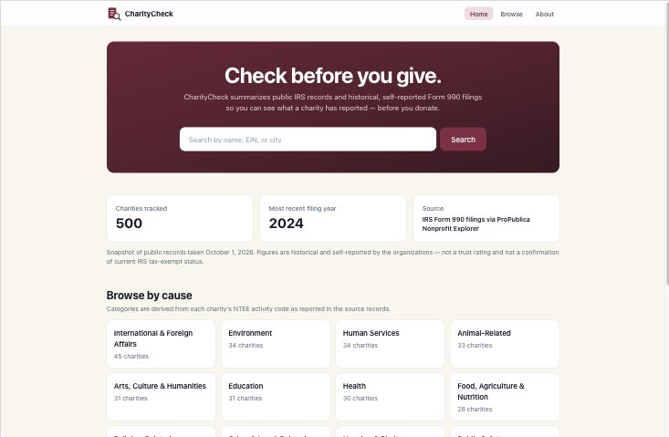

# CharityCheck

Look up public records and past Form 990 figures for U.S. nonprofits before you donate.

**Live:** [charitycheck.leixue.dev](https://charitycheck.leixue.dev/)



## Features

- Browse a 500-organization snapshot, with search by name, EIN or city
- Filter by state, cause and revenue
- Profiles with filing history, financial figures and source links
- Optional live lookup through ProPublica's Nonprofit Explorer

> Informational only: not a trust rating and not a current IRS status check. Verify tax-exempt status with the [IRS search tool](https://apps.irs.gov/app/eos/).

**Tech:** React, TypeScript, Vite, Tailwind CSS, Cloudflare Workers

## Run locally

```bash
npm ci
npm run dev     # start
npm test        # tests
npm run build   # production build
```

More detail (data, refreshing the snapshot, lookup backend): [docs/details.md](docs/details.md)
